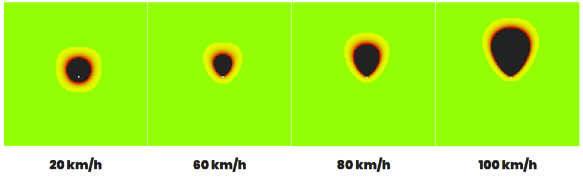
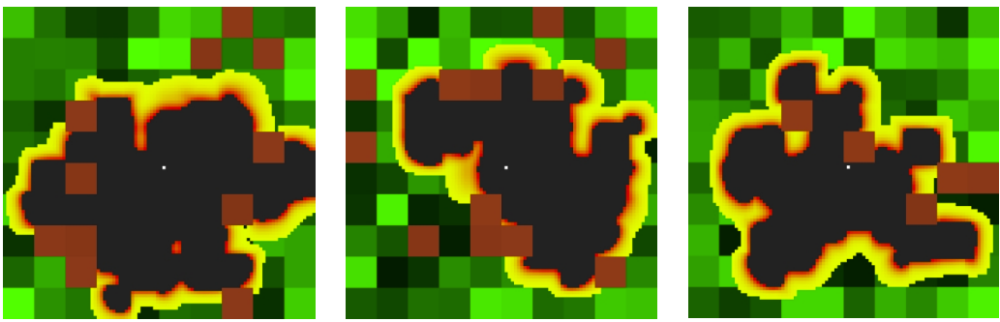
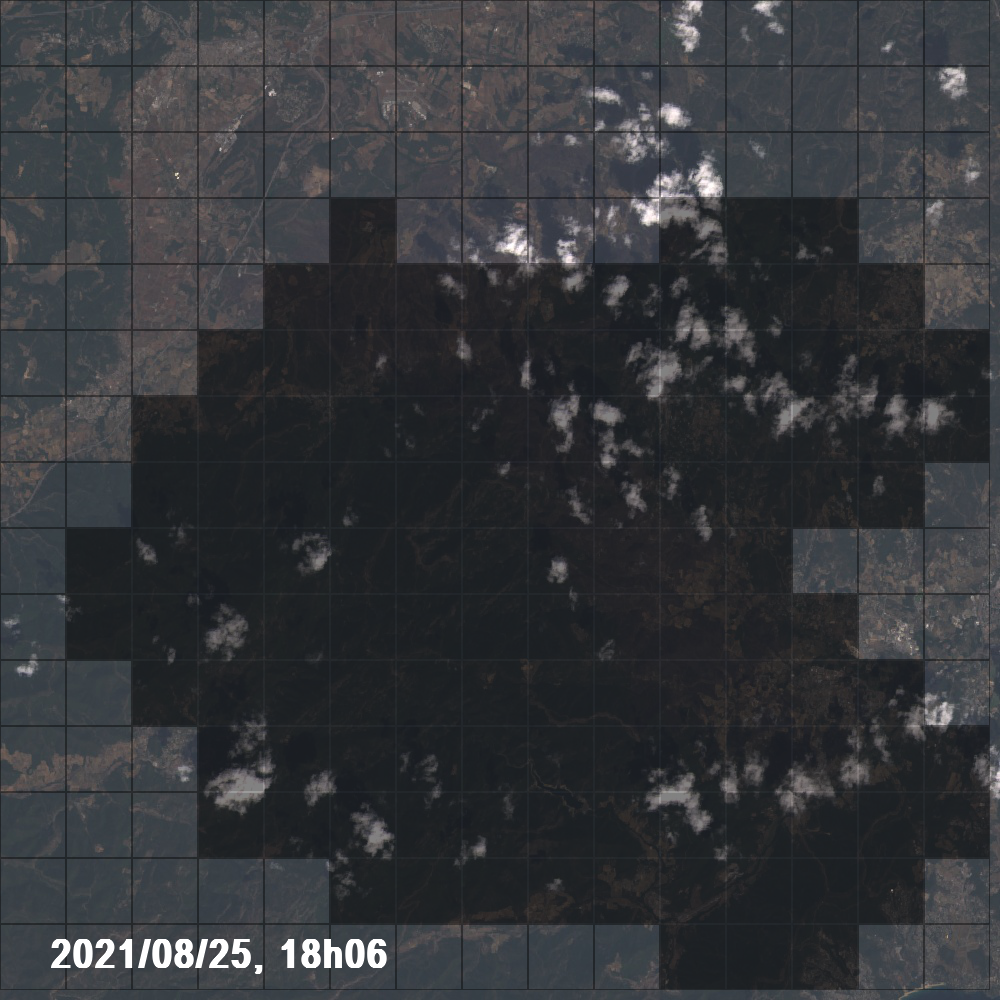

# Forest Fire Propagation Simulation

## PROJECT DESCRIPTION
This Python project simulates forest fire propagation using cellular automata models.
It was developed as a TIPE (Travaux d'Initiative Personnelle Encadrés) project
in French preparatory school by a team of three students.

The simulation explores how environmental factors like wind and vegetation density
affect wildfire spread patterns, using both theoretical models and real-world data
from Google Earth Engine.

## FEATURES
- Multiple fire propagation models:
  * Wind influence simulation
  * Vegetation density (treecover) impact
  * Real case scenario using Google Earth Engine data
- Interactive visualization with Pygame
- Customizable simulation parameters
- Real-time fire spread visualization

## MODELS
1. Wind Model (fire_wind.py):
   - Simulates how wind direction and speed influence fire spread
   - Uses mathematical coefficients to model realistic wind-fire interaction
   - Implements directional propagation algorithms

2. Treecover Model (fire_treecover.py):
   - Models how different vegetation densities affect fire spread
   - Generates terrain with variable forest density
   - Fire propagation depends on local vegetation conditions

3. Real Case Model (Earth_Engine_model):
   - Uses actual geographic data from Google Earth Engine
   - Integrates elevation, temperature, and vegetation data
   - Validates simulation results with FIRMS (Fire Information for Resource Management System) data

## TECHNICAL DETAILS
The simulation uses a grid-based cellular automata approach where:
- Each cell (Parcel) has properties like position, fire state, and terrain type
- Fire propagates to neighboring cells based on probabilities influenced by:
  * Wind direction and speed
  * Vegetation density
  * Terrain features
- Mathematical models determine spread rates and directions

## USAGE
Run the simulation:
1. For theoretical models:
   > python models/fire_screen.py

2. For real case scenario with Google Earth data:
   > python Earth_Engine_model/fire_screen.py

Controls:
- F: Start fire simulation
- R: Reset simulation
- 1: Switch to wind model
- 2: Switch to treecover model
- T: Toggle fire filter (real case comparison)
- U: Toggle background map type
- ENTER: Exit application

## IMPLEMENTATION
The project is organized into several Python modules:
- Parcel class: Represents individual land units with fire properties
- Map class: Manages the grid of parcels and fire propagation logic
- Screen class: Handles visualization and user interaction

The simulation uses Pygame for visualization, displaying:
- Fire spread in real-time
- Different terrain types and properties
- Various data layers (elevation, temperature, etc.)

## RESULTS
The simulation demonstrates:
- Fire spreads faster in the direction of wind
- Areas with higher tree density burn more intensely and spread fire more rapidly
- Comparing simulation results with actual fire data validates the models
- The cellular automata approach effectively captures key fire behavior patterns

## REFERENCES
- Google Earth Engine for geographic data
- FIRMS (Fire Information for Resource Management System)
- Cellular automata fire propagation research

## AUTHORS
TIPE group project with three members:
- GRELLAT--SEVILLA Inès
- LEBERRE Clément
- VILLETTE Martin

## FUTURE IMPROVEMENTS
- Implement more complex terrain features (water bodies, roads)
- Add additional environmental factors (humidity, rainfall)
- Enhance visualization with more detailed statistics
- Optimize algorithms for larger scale simulations
